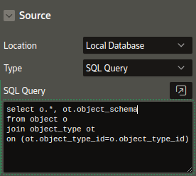
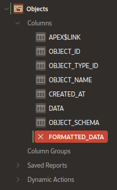
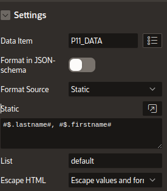
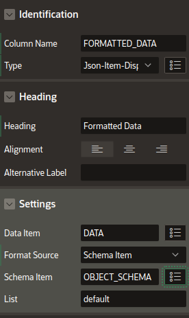
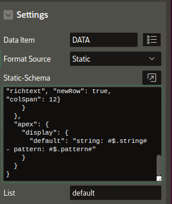
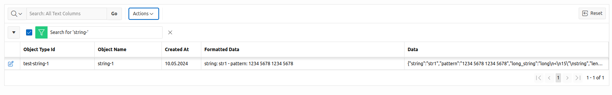
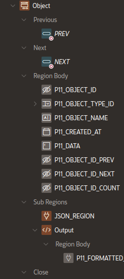
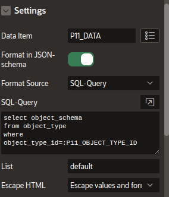
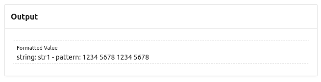
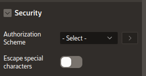

# JSON-item-display

An Oracle-APEX-plugin which formats JSON-data using a format template containing JSON-path-expressions.

The main usecase are lists (interactive grids) with columns containing formated JSON-data depending on an object-type.

The description of the output format is a string containing simple JSON-path-expressions exclosed by **#**.

## Example

For JSON-data
```JSON
{
  "lastname":  "Simon",
  "firstname": "Uwe",
  "address": {
    "country":   "Germany",
    ....
  },
  ...
}

```
the output-format
```
  "User: #$.lastname#, #$firstname# Country: #$.address.country#" 
```
will returns the string like
```
  User:  Simon, Uwe Country: Germany
```
The output-format could be part of the JSON-schema describing the JSON-data or a fixed-string.

As part of a JSON-schema it would look like
```JSON
{
  "type": "object",
  "properties": {

  },
  "apex": {
    "display": {
      "default": "#$.lastname#, #$.firstname#",
      "detail": "#$.lastname#, #$.firstname#, #$.address.country#, #$.address.city#",
    }
  } 
}
```
The JSON-schema can contain several output-formats (here "default" and "detail") used in different lists/interactive grids.

When using the detail format as a fixed format the format string for the configuration will be like
```
  #$.lastname#, #$.firstname#, #$.address.country#, #$.address.city#
```

The screenshot contains the column **Formatted Data**, which contains the formatted data of column **Data** for all "object-types" where a format is defined..


## Configuration of output-formats

The configurastion could be part of a **JSON-region**-configuration (https://github.com/simonuwe/oracle-apex-json-region). So only a single JSON-schema is required to configure both plugins.

The **output-format** uses JSON-path-expressions to access the data inside the JSON-data. The JSON-path-expressions are enclosed by **#**. 
So **#$.lastname#** will access the attribute **lastname** in the JSON-data.
```JSON
{
  "lastname": "Simon",
  "Firstname": "uwe",
  "address": {
    "country": "Germany",
    ....
  }
  ...
}
```
All JSON-path-expressions must return a single value (no an array).
Even more complex expressions are available like **#$.address.country#** to access the country inside the address-subobject

For details of JSON-path-exrepssins see (https://goessner.net/articles/JsonPath/).


## Configuration in Page-Designer

The configuration of the plugin has 2 parts
- the item containing the JSON-data
- The source for the JSON-schema/fixed format. Depending on the source more parameters are required.

The JSON-item-display-plugin can be used as 
- page-item
- interactive-grid-column

### Plugin as item on a page
When using the plugin as a page-item the source of the output-format could be
- part of a JSON-schema or a plain format
- fixed in the page-desiger configuration
- located in another page-item
- retrieved by a SQL-query

### Plugin as column in an interactive-grid
When using the plugin as a column of an interactive grid column the source of the output-format could be
- part of a JSON-schema or a plain format
- fixed in the page-desiger configuration
- located in another (hidden) grid-column

When the format/JSON-schema-column is not included in the base table for the grid a SQL-query like
```SQL
  SELECT o.*, ot.object_schema
  FROM object o
  JOIN object_type ot
  ON (o.object_type_id=ot.object_type_id)
```
is required.
 
### Configuration in GUI

#### In an Interactive-Grid

1. Configure the Datasource for the interactive-grid with a column containing the JSON-schema of the data-column (here **object_schema**)



2. Add a Column the the report



3. Set Column-name and Heading



4. Configure the **Data Item** (column containing the JSON-data), whether the format is part of a JSON-schema and the **Schema Item** (Column contasining the JSON-schema) and the **list** (key in **apex.display** of the JSON-schema).
When the format is not pat of a JSON-schema, the "List" is not required.



Alternative use a fixed JSON-schema containing the output-format, which is then used for all rows of the interactive-grid (here **default**)



It is also possible to use a "simple format string" here (switch off **Format in JSON-schema**).

Now the interactive Grid could be used and should display a report similar to 



containing a column **Fomatted Data**

#### On a Page

1. Add a **page-item** to the page



2. The configuration is similar to the interactive-grid, but there is the additional option **SQL-query** for the source of the JSON-schema/format. The SQL-query must return a single column and a single row containing the JSON-schema/format .



2. Output on a page



To enable the output of HTML-tags in the formatted output, the escaping of special charatoers had to be switched off.




## Known issues
- The configuration for a interactive-grid-column contains "SQL-Query" in the Soruce-selection, this setting is ignored.
- **JSON-item-display-columns do not appear in exports** (csv, pdf, ...) of the interactive-grid. The reason is, that the data for the columns in an export must be returned by a generated SQL-query. But the JSON-item-display-column is a column calculated in Javascript (in the model with a **calcValue**-function depending on the data and the schema). This is the only way to access columns in the same row (here data and JSON-schema).